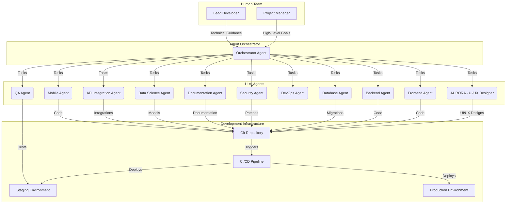

# NOOR AI Agent Architecture Specification

**Version:** 1.0  
**Date:** October 29, 2025  
**Status:** DRAFT - Comprehensive Specification

## 1. Introduction

This document provides the complete architectural specification for the NOOR AI Agent ecosystem. The platform will be developed and maintained by a team of **11 specialized AI agents** working in collaboration with a human-led development team. This hybrid human-AI development model is designed to accelerate development, improve code quality, and ensure continuous, autonomous platform evolution.

### 1.1. Agentic Development Philosophy

The NOOR platform is built on the principle of **agentic software development**. This means that the platform is not just built *with* AI, but is built *by* AI. The 11 AI agents are not tools, but are autonomous team members with specific roles, responsibilities, and areas of expertise.

**Key Principles:**
- **Specialization:** Each agent has a specialized role (e.g., frontend, backend, database, security).
- **Collaboration:** Agents collaborate with each other and with human developers.
- **Autonomy:** Agents can work autonomously on assigned tasks.
- **Quality Gates:** All code produced by agents must pass automated quality gates.
- **Human Oversight:** Human developers provide high-level direction, review critical code, and manage the overall development process.

---

## 2. AI Agent Architecture Overview

The NOOR AI Agent Architecture is a **hierarchical, multi-agent system** with a central orchestrator and specialized execution agents. The architecture is designed to be scalable, resilient, and secure.

### 2.1. Architecture Diagram

### 2.2. Agent Roles & Responsibilities

| Agent Name | Role | Responsibilities |
| :--- | :--- | :--- |
| **Orchestrator** | Project Manager | Breaks down high-level goals into tasks, assigns tasks to agents, monitors progress, and reports to human team. |
| **AURORA** | UI/UX Designer | Creates UI/UX designs, generates component specifications, and ensures brand consistency. |
| **Frontend Agent** | Frontend Developer | Develops and maintains the frontend of the web application (React/Vue.js). |
| **Backend Agent** | Backend Developer | Develops and maintains the backend services and APIs (Node.js/Python). |
| **Database Agent** | Database Administrator | Manages the database schema, writes migrations, and optimizes queries. |
| **Security Agent** | Security Engineer | Scans for vulnerabilities, applies security patches, and ensures compliance. |
| **QA Agent** | Quality Assurance | Writes and runs automated tests (unit, integration, E2E), and reports bugs. |
| **DevOps Agent** | DevOps Engineer | Manages the CI/CD pipeline, infrastructure as code, and deployments. |
| **Documentation Agent** | Technical Writer | Writes and maintains all technical documentation, including API docs and user guides. |
| **Data Science Agent** | Data Scientist | Develops and trains machine learning models for features like mentor matching and predictive analytics. |
| **API Integration Agent** | Integration Specialist | Manages integrations with third-party APIs (e.g., Stripe, UAE Pass). |
| **Mobile Agent** | Mobile Developer | Develops and maintains the native mobile applications (iOS/Android). |

---

## 3. Agent Communication & Collaboration

### 3.1. Communication Protocol

Agents communicate with each other and with the Orchestrator through a standardized **Model Context Protocol (MCP)**. All communication is asynchronous and message-based.

**Message Types:**
- **Task Assignment:** From Orchestrator to execution agent.
- **Task Progress:** From execution agent to Orchestrator.
- **Task Completion:** From execution agent to Orchestrator.
- **Information Request:** Between agents (e.g., Frontend Agent requests API spec from Backend Agent).
- **Information Response:** Between agents.

### 3.2. Collaboration Workflow

**Example Workflow: Adding a New Feature**

1. **Human PM:** Defines a high-level goal (e.g., "Add a new Guilds feature").
2. **Orchestrator:** Breaks the goal into tasks:
   - Task 1 (AURORA): Design the UI for the Guilds feature.
   - Task 2 (Backend Agent): Create the API endpoints for Guilds.
   - Task 3 (Database Agent): Create the database schema for Guilds.
   - Task 4 (Frontend Agent): Implement the UI for the Guilds feature.
   - Task 5 (QA Agent): Write tests for the Guilds feature.
3. **Agents Execute Tasks:** Agents work in parallel on their assigned tasks, pushing code and artifacts to the Git repository.
4. **CI/CD Pipeline:** The CI/CD pipeline automatically builds, tests, and deploys the new feature to the staging environment.
5. **QA Agent:** Runs automated tests on the staging environment.
6. **Human LeadDev:** Reviews the code and test results.
7. **DevOps Agent:** Deploys the new feature to production after approval.

---

## 4. Data Flow & Management

### 4.1. Data Sources

- **Git Repository:** Single source of truth for all code, documentation, and infrastructure definitions.
- **Project Management System:** (e.g., Jira, Trello) for tracking high-level goals and epics.
- **MCP Server Logs:** All agent communications are logged for audit and analysis.

### 4.2. Data Security

- **Credentials Management:** All agent credentials and API keys are stored in a secure vault (e.g., HashiCorp Vault).
- **Access Control:** Agents have role-based access to resources (e.g., only the DBAgent can modify the production database schema).
- **Code Scanning:** The Security Agent continuously scans all code for vulnerabilities.

---

## 5. Governance & Oversight

### 5.1. Human-in-the-Loop

While agents are autonomous, human oversight is critical for:
- **Strategic Direction:** Setting high-level goals and priorities.
- **Ethical Considerations:** Ensuring the platform is developed and used ethically.
- **Critical Code Review:** Reviewing and approving all security-sensitive or business-critical code.
- **Dispute Resolution:** Resolving conflicts or ambiguities between agents.

### 5.2. Performance Monitoring

- **Agent Performance:** The Orchestrator tracks the performance of each agent (e.g., task completion time, code quality).
- **Platform Performance:** The DevOps Agent monitors the performance of the live platform (e.g., uptime, response time, error rates).

---

## 6. Technical Stack

- **Agent Framework:** Custom-built on Python with LangChain and other open-source libraries.
- **MCP Servers:** FastAPI-based servers for agent communication.
- **Development Environment:** Docker containers for each agent.
- **CI/CD:** GitHub Actions.
- **Infrastructure:** Terraform for infrastructure as code.

---

## 7. Conclusion

The NOOR AI Agent Architecture provides a robust, scalable, and secure framework for building and maintaining the NOOR platform. By leveraging a team of specialized AI agents, we can accelerate development, improve quality, and create a platform that can autonomously evolve to meet the future needs of the UAE.

