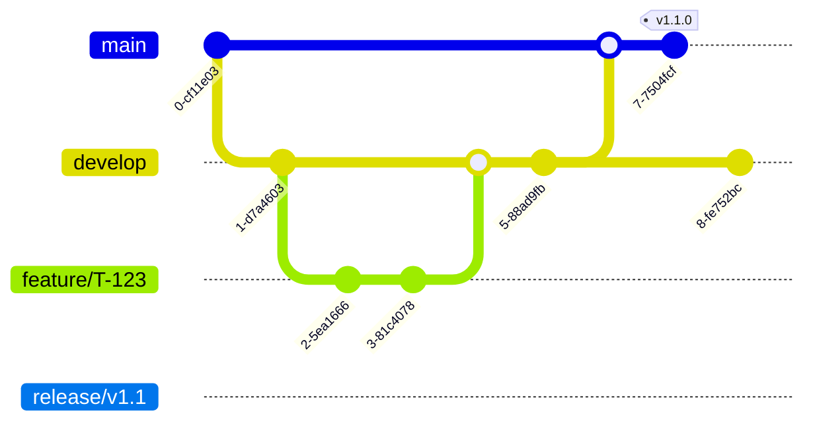

# NOOR Agent Collaboration & Workflow Protocols

**Version:** 1.0  
**Date:** October 29, 2025  
**Status:** DRAFT - Comprehensive Specification

## 1. Introduction

This document defines the protocols and workflows that govern the collaboration between the 11 AI agents and their human counterparts in the NOOR development team. These protocols are designed to ensure seamless, efficient, and high-quality software development in a hybrid human-AI environment.

## 2. Communication Protocol: Model Context Protocol (MCP)

All communication between agents is asynchronous and mediated by a central MCP server. This ensures that all interactions are logged, auditable, and standardized.

### MCP Message Structure

```json
{
  "message_id": "uuid",
  "timestamp": "iso_8601_timestamp",
  "source_agent": "agent_name",
  "target_agent": "agent_name",
  "message_type": "TASK_ASSIGNMENT | TASK_PROGRESS | ...",
  "payload": {
    // Message-specific data
  }
}
```

### Key Message Types

| Message Type | Description |
| :--- | :--- |
| `TASK_ASSIGNMENT` | From Orchestrator to an execution agent, assigning a new task. |
| `TASK_PROGRESS` | From an execution agent to the Orchestrator, providing a status update. |
| `TASK_COMPLETION` | From an execution agent to the Orchestrator, indicating a task is complete. |
| `INFORMATION_REQUEST` | Between agents to request information (e.g., API spec). |
| `INFORMATION_RESPONSE` | The response to an `INFORMATION_REQUEST`. |
| `BUG_REPORT` | From the QA Agent to the Orchestrator and relevant developer agent. |
| `VULNERABILITY_REPORT` | From the Security Agent to the Orchestrator. |

## 3. Development Workflow: Agentic Git Flow

We use a Git flow inspired branching model, adapted for an agentic development team.

### Branching Strategy

- **`main`**: The production branch. Only the DevOps Agent can merge into `main`.
- **`develop`**: The integration branch. All feature branches are merged into `develop`.
- **`feature/<task-id>`**: Each new feature is developed in its own branch, created by the assigned agent.
- **`bugfix/<bug-id>`**: Bug fixes are developed in their own branches.
- **`hotfix/<issue-id>`**: Urgent production fixes are developed in hotfix branches.

### Workflow Diagram



## 4. Feature Development Workflow

This workflow describes the end-to-end process for developing a new feature.

1.  **Goal Definition (Human PM):** The human Project Manager defines a high-level goal in the project management system (e.g., Jira).

2.  **Task Decomposition (Orchestrator):** The Orchestrator Agent breaks the goal down into specific, actionable tasks for each required agent.

3.  **Branch Creation (Developer Agents):** The assigned developer agents (Frontend, Backend, etc.) create a new `feature/<task-id>` branch.

4.  **Development (Developer Agents):** Agents write the code for the feature.

5.  **Code Commit (Developer Agents):** Agents commit their code to the feature branch with descriptive commit messages.

6.  **Pull Request (Developer Agents):** Once development is complete, the agent creates a Pull Request (PR) to merge the feature branch into `develop`.

7.  **Code Review (Human LeadDev & Peer Agents):**
    - The human Lead Developer reviews the PR for architectural and business logic correctness.
    - Peer agents can be requested to review the code (e.g., Security Agent reviews for vulnerabilities).

8.  **Automated Testing (QA Agent & CI/CD):**
    - The CI pipeline automatically runs unit and integration tests.
    - The QA Agent runs E2E tests on the deployed feature in a staging environment.

9.  **Merge (Developer Agents):** After approval and successful tests, the PR is merged into `develop`.

10. **Deployment (DevOps Agent):** The DevOps Agent deploys the `develop` branch to the staging environment, and eventually, the `main` branch to production.

## 5. Bug Fixing Workflow

1.  **Bug Report (QA Agent or Human):** A bug is reported in the bug tracking system.

2.  **Triage (Orchestrator):** The Orchestrator Agent assesses the bug's severity and assigns it to the appropriate developer agent.

3.  **Branch Creation (Developer Agent):** The agent creates a `bugfix/<bug-id>` branch.

4.  **Fix Development (Developer Agent):** The agent writes the code to fix the bug.

5.  **Pull Request & Review:** The same PR and review process as for features is followed.

6.  **Verification (QA Agent):** The QA Agent verifies that the bug is fixed in the staging environment.

7.  **Merge & Deploy:** The fix is merged and deployed.

## 6. Conflict Resolution Protocol

Conflicts between agents are rare but can occur (e.g., disagreement on an API contract).

1.  **Direct Negotiation:** The agents first attempt to resolve the conflict through direct MCP communication.

2.  **Escalation to Orchestrator:** If they cannot agree, the conflict is escalated to the Orchestrator Agent.

3.  **Orchestrator Decision:** The Orchestrator makes a decision based on the overall project goals and technical context.

4.  **Human Intervention:** If the conflict is particularly complex or has significant architectural implications, the Orchestrator escalates it to the human Lead Developer for a final decision.

## 7. Human-AI Collaboration Protocol

- **High-Level Direction:** Humans provide high-level goals, not detailed instructions.
- **Trust but Verify:** Trust the agents to do their work, but verify the results through code reviews and testing.
- **Focus on What, Not How:** Define *what* needs to be done, and let the agents figure out *how* to do it.
- **Continuous Feedback:** Provide continuous feedback to the agents to help them learn and improve.

