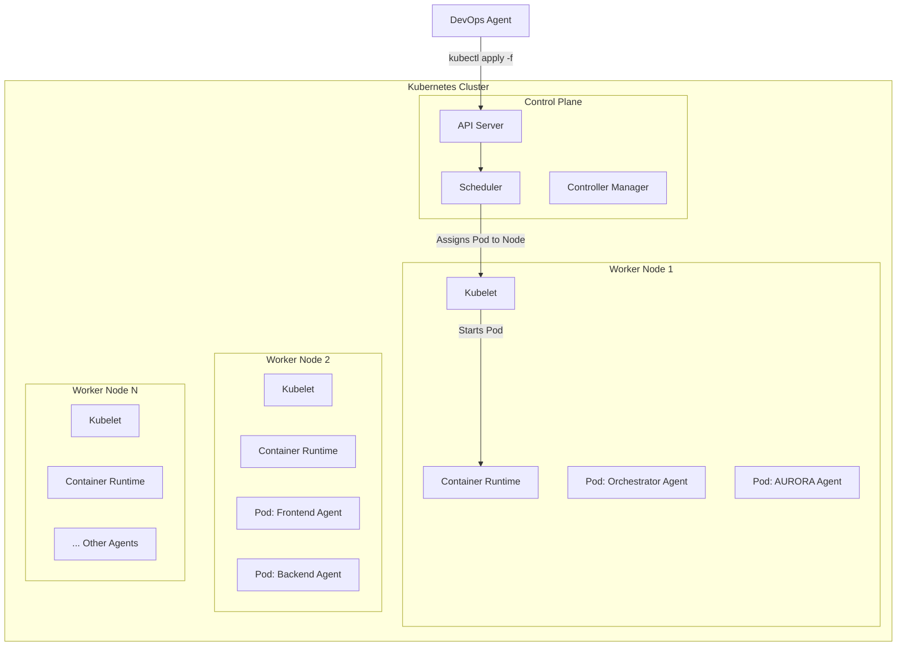

# NOOR Agent Deployment & Orchestration System

**Version:** 1.0  
**Date:** October 29, 2025  
**Status:** DRAFT - Comprehensive Specification

## 1. Introduction

This document specifies the system for deploying, managing, and orchestrating the 11 AI agents that constitute the NOOR development team. The system is designed for scalability, resilience, and security, ensuring that the agentic workforce can operate efficiently and autonomously.

## 2. Deployment Architecture

Each AI agent is packaged as a **Docker container** and deployed as a **Kubernetes pod**. This container-based approach provides a consistent, isolated, and scalable environment for each agent.

### 2.1. Kubernetes Cluster Setup

- A dedicated Kubernetes cluster is provisioned for the AI agent workforce.
- The cluster is composed of a control plane and a set of worker nodes.
- Each agent runs in its own pod, with resource requests and limits defined to ensure fair resource allocation.

### 2.2. Agent Pod Specification

Each agent's Kubernetes deployment specification includes:

- **Container Image:** The Docker image for the agent.
- **Resource Requests/Limits:** CPU and memory allocation.
- **Environment Variables:** Configuration and secrets mounted from ConfigMaps and Secrets.
- **Network Policies:** Rules defining which other agents or services the agent can communicate with.
- **Persistent Volumes:** For agents that require persistent state (e.g., a fine-tuned model cache).

### 2.3. Deployment Diagram

## 3. Orchestration Engine

The **Orchestrator Agent** acts as the brain of the agentic workforce. It is responsible for managing the lifecycle of tasks and coordinating the work of the other 10 execution agents.

### 3.1. Task Queue

- The Orchestrator maintains a persistent task queue (e.g., using Redis or RabbitMQ).
- When a new goal is received, it is broken down into tasks which are pushed to the queue.
- Execution agents poll the queue for tasks assigned to them.

### 3.2. Dynamic Scaling

- The Orchestrator monitors the task queue length and the resource utilization of each agent.
- If a particular agent's queue is growing, the Orchestrator can automatically scale up the number of replicas for that agent's Kubernetes deployment.
- For example, if there is a high volume of frontend tasks, the Orchestrator can scale the Frontend Agent from 1 to 3 replicas.

## 4. CI/CD for Agents

The agents themselves are software and have their own CI/CD pipeline for updates and improvements.

1.  **Code Change:** A human developer improves an agent's core logic (e.g., adds a new skill to the Frontend Agent).
2.  **Git Commit:** The change is committed to the agent's dedicated Git repository.
3.  **CI Pipeline:** A GitHub Actions pipeline is triggered, which:
    - Lints and tests the agent's code.
    - Builds a new Docker image for the agent.
    - Pushes the new image to a container registry (e.g., Docker Hub, AWS ECR).
4.  **CD Pipeline (DevOps Agent):** The DevOps Agent detects the new image and updates the agent's Kubernetes deployment, performing a rolling update to the new version with zero downtime.

## 5. Configuration and Secrets Management

- **Configuration:** Agent configuration (e.g., API endpoints, model parameters) is stored in Kubernetes **ConfigMaps**.
- **Secrets:** Sensitive information (e.g., API keys, database passwords) is stored in Kubernetes **Secrets**.
- This separation allows configuration to be managed in Git, while secrets are stored securely in a vault like HashiCorp Vault and injected into the cluster.

## 6. Deployment Workflow

Deploying a new agent or updating an existing one follows this workflow:

1.  **Create/Update Agent Code:** Develop the agent's logic in its Git repository.
2.  **Create Dockerfile:** Define the agent's environment and dependencies in a Dockerfile.
3.  **Build & Push Image:** The CI pipeline builds the Docker image and pushes it to the registry.
4.  **Create Kubernetes Manifests:** The DevOps Agent creates the Kubernetes `Deployment`, `Service`, `ConfigMap`, and `Secret` manifests.
5.  **Deploy to Staging:** The DevOps Agent applies the manifests to the staging Kubernetes cluster.
6.  **Test in Staging:** The QA Agent and human developers test the new agent in the staging environment.
7.  **Deploy to Production:** Once validated, the DevOps Agent promotes the deployment to the production cluster.

