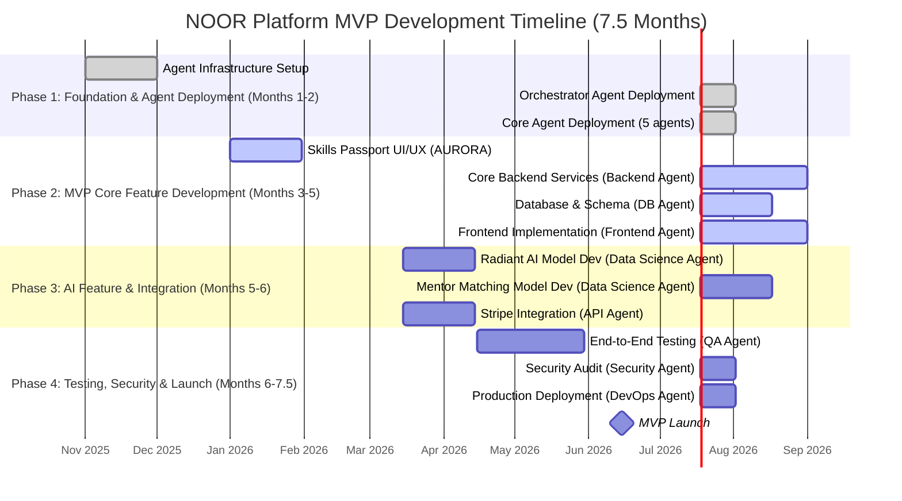

# NOOR Agentic Deployment Implementation Roadmap

**Version:** 1.0  
**Date:** October 29, 2025  
**Status:** DRAFT - Comprehensive Specification

## 1. Introduction

This document outlines the phased implementation roadmap for deploying the NOOR AI agent workforce and developing the Minimum Viable Product (MVP) of the NOOR platform. The roadmap is designed to be aggressive yet achievable, leveraging the power of agentic development to deliver a production-ready platform in **7.5 months**.

## 2. Overall Timeline

## 3. Phased Implementation Plan

### Phase 1: Foundation & Agent Deployment (Months 1-2)

**Goal:** To deploy the core AI agent workforce and set up the development infrastructure.

| Week | Key Activities | Lead Agent(s) | Deliverables |
| :--- | :--- | :--- | :--- |
| 1-2 | **Infrastructure Setup:** Provision Kubernetes cluster, set up Git repos, configure CI/CD basics. | DevOps Agent, Human | Production-ready K8s cluster. |
| 3-4 | **Orchestrator Deployment:** Deploy and configure the Orchestrator Agent. | DevOps Agent | Live Orchestrator Agent. |
| 5-6 | **Core Agent Deployment:** Deploy AURORA, Frontend, Backend, DB, and QA agents. | Orchestrator | 5 core agents ready for tasks. |
| 7-8 | **Workflow Integration:** Integrate agents with Jira and establish basic workflows. | Orchestrator | Agents responding to tasks. |

### Phase 2: MVP Core Feature Development (Months 3-5)

**Goal:** To develop the core features of the Skills Passport (Layer 1 MVP).

| Month | Key Activities | Lead Agent(s) | Deliverables |
| :--- | :--- | :--- | :--- |
| 3 | **UI/UX Design:** AURORA designs the 5 core Skills Passport pages. | AURORA | High-fidelity mockups in Figma. |
| 4 | **Backend & Database:** Backend Agent builds core APIs; DB Agent sets up schema. | Backend, DB | Live APIs and database schema. |
| 5 | **Frontend Implementation:** Frontend Agent builds the UI based on AURORA's designs. | Frontend | Interactive web application. |

### Phase 3: AI Feature & Integration (Months 5-6)

**Goal:** To develop the AI-powered features and integrate essential third-party services.

| Week | Key Activities | Lead Agent(s) | Deliverables |
| :--- | :--- | :--- | :--- |
| 19-22 | **Radiant AI Model:** Data Science Agent develops the competency assessment AI. | Data Science | Deployed Radiant AI model API. |
| 23-26 | **Mentor Matching Model:** Data Science Agent develops the mentor matching algorithm. | Data Science | Deployed mentor matching API. |
| 19-22 | **Stripe & UAE Pass Integration:** API Agent integrates payment and authentication services. | API Agent | Live payment and login functionality. |

### Phase 4: Testing, Security & Launch (Months 6-7.5)

**Goal:** To ensure the platform is stable, secure, and ready for launch.

| Month | Key Activities | Lead Agent(s) | Deliverables |
| :--- | :--- | :--- | :--- |
| 6 | **Comprehensive Testing:** QA Agent runs full E2E, performance, and regression tests. | QA Agent | Test report with >95% pass rate. |
| 7 | **Security Audit:** Security Agent performs a full security audit and penetration test. | Security Agent | Security audit report. |
| 7.5 | **Production Deployment:** DevOps Agent deploys the platform to the production environment. | DevOps Agent | Live NOOR MVP platform. |
| 7.5 | **MVP Launch:** Official launch of the NOOR platform to the public. | Human Team | Public announcement. |

## 4. Post-MVP Roadmap

-   **Months 8-10:** Develop Layer 2 (Institutional Interface). Deploy remaining 5 AI agents.
-   **Months 11-12:** Develop Layer 3 (Federal Canvas).
-   **Continuous:** The AI agent team will continuously work on improving the platform, adding new features, and fixing bugs.

