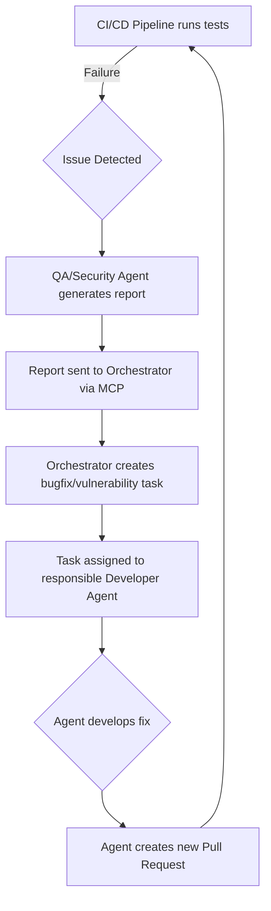

# NOOR Agent Monitoring & Quality Assurance Framework

**Version:** 1.0  
**Date:** October 29, 2025  
**Status:** DRAFT - Comprehensive Specification

## 1. Introduction

This document outlines the comprehensive framework for monitoring the performance of the NOOR AI agent workforce and ensuring the quality of the software they produce. The framework combines automated systems with strategic human oversight to maintain high standards of performance, reliability, and security.

## 2. Agent Performance Monitoring

We will monitor the performance of each individual agent to ensure they are operating efficiently and effectively.

### 2.1. Key Performance Indicators (KPIs)

Each agent has a set of specific KPIs tracked by the Orchestrator Agent. These include:

| Agent Role | KPI | Description |
| :--- | :--- | :--- |
| **All Agents** | **Task Completion Rate** | Percentage of assigned tasks completed successfully. |
| | **Average Task Cycle Time** | Average time from task assignment to completion. |
| **Developer Agents** | **Code Churn** | Amount of code that is rewritten or deleted shortly after being committed. |
| | **Bug Introduction Rate** | Number of bugs introduced per 1,000 lines of code. |
| **AURORA** | **Design Revision Rate** | Number of times a design needs to be revised after initial creation. |
| **QA Agent** | **Bug Detection Accuracy** | Percentage of bugs correctly identified by automated tests. |
| **Security Agent** | **Vulnerability False Positive Rate** | Percentage of reported vulnerabilities that are not actual threats. |

### 2.2. Monitoring Dashboard

A centralized Grafana dashboard will be used to visualize agent performance in real-time. The dashboard will display:

-   **Team-level metrics:** Overall velocity, cycle time, and number of open tasks.
-   **Agent-level metrics:** Individual agent KPIs, resource utilization (CPU/memory), and current task.
-   **Task Queue Status:** Number of tasks in the queue, waiting time, and priority distribution.

### 2.3. Alerting

Prometheus alerts are configured to notify the human Lead Developer if:

-   An agent's performance drops below a predefined threshold.
-   An agent's pod crashes or becomes unresponsive.
-   The task queue length exceeds a critical limit.

## 3. Software Quality Assurance

We employ a multi-layered approach to ensure the quality of the software produced by the agents.

### 3.1. Code Quality Gates

Every pull request automatically triggers a series of code quality checks in the CI/CD pipeline:

-   **Linting:** Code is automatically checked against a predefined style guide (e.g., ESLint for frontend, Pylint for backend).
-   **Static Code Analysis:** SonarQube is used to analyze code for bugs, code smells, and security vulnerabilities.
-   **Code Complexity:** Tools are used to measure cyclomatic complexity and flag code that is too difficult to maintain.

### 3.2. Automated Testing Layers

-   **Unit Tests:** Written by the developer agents to test individual functions and components. Must achieve >80% code coverage.
-   **Integration Tests:** Written by the developer agents to test the interaction between different services.
-   **End-to-End (E2E) Tests:** Written by the QA Agent using Cypress to simulate real user journeys.
-   **Visual Regression Testing:** The QA Agent uses a tool like Percy to automatically detect unintended UI changes.

### 3.3. Security Assurance

-   **Dependency Scanning:** The Security Agent uses Snyk to scan all dependencies for known vulnerabilities.
-   **SAST & DAST:** The Security Agent performs Static Application Security Testing (SAST) on the code and Dynamic Application Security Testing (DAST) on the running application in the staging environment.

## 4. QA Feedback Loop

When a quality issue is detected, an automated feedback loop is initiated.

### 4.1. Feedback Loop Diagram

### 4.2. Process

1.  The CI/CD pipeline runs the full suite of automated tests.
2.  If a test fails or a vulnerability is found, the pipeline stops.
3.  The relevant agent (QA or Security) generates a detailed report.
4.  The report is sent to the Orchestrator, which creates a high-priority task.
5.  The task is assigned to the agent responsible for the original code.
6.  The agent develops a fix and submits a new pull request, restarting the cycle.

## 5. Human-in-the-Loop (HITL) for Quality

Automated systems are supplemented by crucial human oversight.

-   **Critical Code Reviews:** The human Lead Developer reviews and must approve all pull requests for security-sensitive, business-critical, or architecturally significant code.
-   **Exploratory Testing:** Human QA engineers periodically perform unscripted, exploratory testing on the staging environment to uncover issues that automated tests might miss.
-   **User Acceptance Testing (UAT):** Before a major release, human stakeholders (including the Product Manager) perform UAT to ensure the new features meet business requirements.

## 6. Continuous Improvement

The monitoring and QA framework is designed to be a learning system.

-   **Agent Fine-Tuning:** Performance data from the monitoring dashboard is used to identify areas where agents can be improved. This data provides the basis for fine-tuning the agents' underlying models.
-   **Process Improvement:** QA metrics (e.g., number of escaped defects) are reviewed in a weekly meeting with the human team to identify and address systemic issues in the development process.

